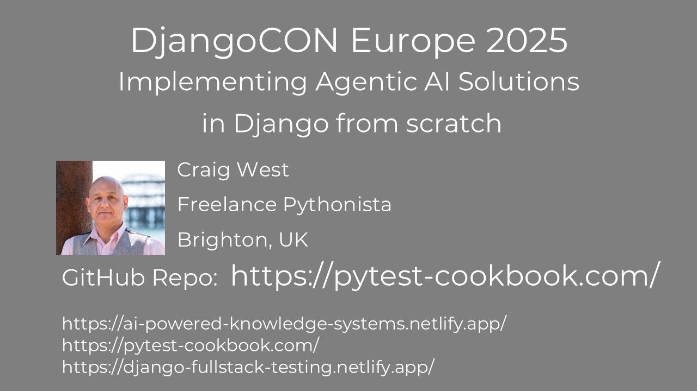

# DjangoCON Europe 2025

You will need an LLM API key.

Groq offers a free tier and uses the same API signature as OpenAI.

Code examples will be able to use either Groq or OpenAI except a few which are for demo purposes only.

To run LLMs, copy .env.sample to .env and add your OpenAI key or Groq API key:

OPENAI_API_KEY=sk-proj-TQa...
GROQ_API_KEY=gsk_ow4T...

Groq offers a free tier and uses the same API signature as OpenAI.
